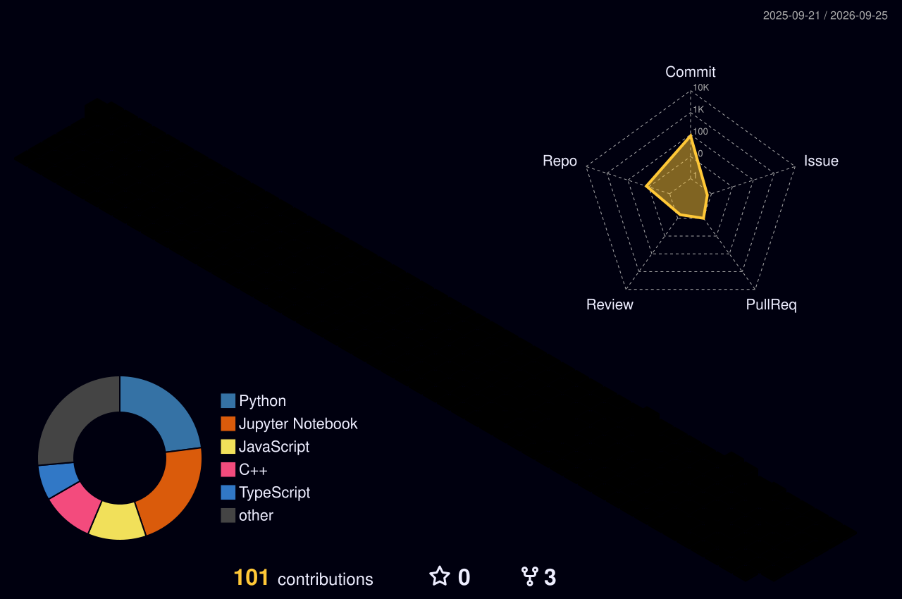

<div align="center">
  
</div>

<br/>

<div align="center">
  <a href="https://www.linkedin.com/in/medha-sriram-24bb8a28a/">
    
  </a>
  &nbsp;
  <a href="mailto:medhasriram245@gmail.com">
    
  </a>
  &nbsp;
  
</div>

---

```python
class Medha:
    university = "VIT Vellore  ·  B.Tech CSE (AI & ML)  ·  2023–2027  ·  8.64 CGPA"
    currently  = ["drone autonomy stack", "rover perception pipeline", "anything that ships"]
    competed   = {"IRC 2025": "13th / 100+ teams", "IRDC 2025": "Top 5 Finalist"}
    certs      = ["Oracle OCI 2025 Generative AI Professional", "Google Data Analytics"]
    principle  = "real-world deployment > lab benchmarks"
```

---

### 🧠 what I work with

<table>
<tr>
<td valign="top" width="50%">

**AI & Machine Learning**
```
PyTorch · TensorFlow · HuggingFace
BERT · LLMs · scikit-learn
```

**Computer Vision**
```
OpenCV · YOLOv8 · MediaPipe
Intel RealSense SDK · Depth Estimation
```

**Robotics & Autonomy**
```
ROS2 · Nav2 · RTAB-Map · SLAM
EKF Sensor Fusion · Point Clouds
```

</td>
<td valign="top" width="50%">

**Cloud & Backend**
```
AWS Lambda · DynamoDB · S3
Cognito · API Gateway · Docker
```

**Languages**
```
Python · C++ · TypeScript
JavaScript · SQL · Bash
```

**Tools**
```
Git · Linux · RViz · Gazebo · Jupyter
```

</td>
</tr>
</table>

---

### 🚀 shipped

<details>
<summary><b>autonomous rover navigation stack</b> &nbsp;·&nbsp; ROS2 · YOLOv8 · RTAB-Map · RealSense</summary>
<br>

full perception + planning for unstructured terrain.
- **RTAB-Map SLAM** + GridMap 2.5D elevation via RealSense D455
- custom **YOLOv8** for cone detection + terrain segmentation → wired into Nav2 costmap
- **EKF fusion** across IMU, GPS, wheel encoders → Nav2 Smac + MPPI controller
- **result:** 13th / 100+ teams at IRC 2025

</details>

<details>
<summary><b>multilingual PDF intelligence pipeline</b> &nbsp;·&nbsp; BERT · Docker · NLP &nbsp;·&nbsp; <i>Adobe Hackathon 2025</i></summary>
<br>

fully offline. zero API calls. dockerized.
- local **multilingual BERT** embeddings → cosine similarity vs persona/job-description vectors
- H1/H2/H3 from font-size hierarchy · script-pattern language detection
- structured JSON output with ranked sections + snippets

</details>

<details>
<summary><b><a href="https://github.com/M3dh4/Notefy">notefy</a></b> &nbsp;·&nbsp; TypeScript · AWS · Gemini</summary>
<br>

serverless collaborative notes. Lambda + DynamoDB + Cognito + S3.
Gemini auto-generates MCQs from any uploaded PDF.

</details>

<details>
<summary><b><a href="https://github.com/M3dh4/Email-Spam-Detection">email spam detection</a></b> &nbsp;·&nbsp; Python · scikit-learn</summary>
<br>

LR vs SVM vs RF vs Naive Bayes on TF-IDF — precision/recall/F1 trade-off study.

</details>

---

### 📊 stats

<div align="center">


&nbsp;


</div>

---

### 🏆 trophies

<div align="center">

[](https://github.com/M3dh4)

</div>

---

### 🌐 3D contribution map

<!-- Run the GitHub Action once → then uncomment this and delete the placeholder -->
<!--  -->

<details>
<summary>⚙️ one-time setup (2 min)</summary>
<br>

Create `.github/workflows/3d-contrib.yml`:

```yaml
name: 3D Contrib
on:
  schedule: [{ cron: "0 18 * * *" }]
  workflow_dispatch:
permissions:
  contents: write
jobs:
  build:
    runs-on: ubuntu-latest
    steps:
      - uses: actions/checkout@v5
      - uses: yoshi389111/github-profile-3d-contrib@latest
        env:
          GITHUB_TOKEN: ${{ secrets.GITHUB_TOKEN }}
          USERNAME: M3dh4
      - run: |
          git config user.name github-actions
          git config user.email github-actions@github.com
          git add -A .
          if git commit -m "update 3d contrib"; then git push; fi
```

Then **Actions → 3D Contrib → Run workflow**. Once done, swap the comment above.

</details>

---

<div align="center">

*open to collaborating on robotics, perception, and anything that actually ships.*

</div>
